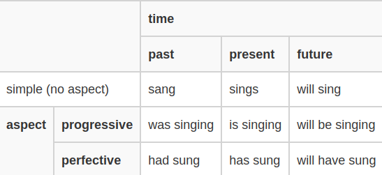

# Tất tần tật về Động từ trong Tiếng Anh

!!! info "Định dạng bài viết"
    Có khá nhiều bài viết trong mục này chưa được chỉnh sửa lại định dạng. Số lượng bài viết trong mục này rất nhiều nên làm chưa xong. Khi nào xong toàn bộ bài viết thì thông báo này sẽ được xóa :D 

## Động từ là gì?
Động từ là từ chỉ hành động (I **speak** English) và trạng thái (He **seems** normal). 

Động từ luôn đi cùng với chủ ngữ và động từ để chỉ hành động hoặc trạng thái của chủ ngữ.

> verbs are words that tell us what a subject does or is ([EnglishClub](https://www.englishclub.com/grammar/verb-what.php))

### Phân loại động từ

Động từ có hai loại: main verbs (Động từ chính hay "Động từ thường"), helping verbs (Hay còn gọi là trợ động từ).

#### Trợ động từ

Hãy tưởng tượng đột nhiên một thằng cha nào đấy xuất hiện trước mặt bạn và nói:

- 'I can'
- 'I must'
- 'I shouldn't'

Bạn có hiểu gã ấy đang nói gì không? Chắc chắn là không. Những động từ ở trên được gọi là "helping verbs" hay trợ động từ và bản thân trợ động từ không có ý nghĩa, nhưng lại có vai trò quan trọng trong cấu trúc ngữ pháp của câu. Chúng đi cùng với động từ chính (main verbs) và bổ trợ cho động từ chính (trong câu, trợ động từ cần ít nhất một động từ chính). Chỉ có khoảng 15 trợ động từ.

#### Động từ chính
Là động từ có ý nghĩa, kể cả khi đứng độc lập. Ví dụ như 'I speak', 'He teaches', 'People eat' chẳng hạn.

Động từ chính còn có nhiều dạng nữa nhưng chắc là đề cập sau.

### Dạng động từ

Danh sách các dạng động từ bao gồm:
- base V1 (Dạng gốc)
- past simple V2 (Quá khứ phân từ 2)
- [past participle V3 (Quá khứ phân từ 3)](https://flyer.vn/qua-khu-phan-tu/)
- [present participle (Hiện tại phân từ)](https://ielts.idp.com/vietnam/prepare/article-present-participle)
- 3rd person singular present simple (Hiện tại ngôi thứ 3)

Trong bảng này, các ô được bỏ trống có nghĩa là dạng tiếp theo của nó cũng sẽ tương tự dạng trước. Ví dụ như từ "made" thì V2 và V3 đều là made nên ô ở V3 sẽ được bỏ trống. 

|   | V1 | V2 | V3 | present participle | 3rd person singular present simple |
| --- | --- | --- | --- | --- | --- | 
| Có quy tắc | work | worked | | working | works 
| Bất quy tắc | cut |  |  |  cutting | cuts | 
| | make | made | | making | makes |
| | sing| sang | sung | singing | sings |

[Bảng được cắt từ EnglishClub](https://www.englishclub.com/grammar/verb-forms.php).

### Thì Tiếng Anh

#### Thì trong ngôn ngữ là gì?
Khi nói về thì thì không thể không nói đến **time** và **aspect**.

**Time** để chỉ:

-   **quá khứ** - trước *bây giờ*
-   **hiện tại** - *bây giờ*
-   **tương lai** - sau *bây giờ*

**Aspect** để chỉ:

-   **tiếp diễn** - *uncompleted action*
-   **hoàn thành** - *completed action or state*

#### Hệ thống thì trong Tiếng Anh

#### 12 thì cơ bản
- Thì hiện tại 
    - [Đơn](hien-tai-don.md)
    - [Tiếp diễn](hien-tai-tiep-dien.md)
    - [Hoàn thành](hien-tai-hoan-thanh.md)
    - [Hoàn thành tiếp diễn](hien-tai-hoan-thanh-tiep-dien.md)
- Thì quá khứ
    - [Đơn](qua-khu-don.md)
    - [Tiếp diễn](qua-khu-tiep-dien.md)
    - [Hoàn thành](qua-khu-hoan-thanh.md)
    - [Hoàn thành tiếp diễn](qua-khu-hoan-thanh-tiep-dien.md)
- Thì tương lai 
    - [Đơn](tuong-lai-don.md)
    - [Tiếp diễn](tuong-lai-tiep-dien.md)
    - [Hoàn thành](tuong-lai-hoan-thanh.md)
    - [Hoàn thành tiếp diễn](tuong-lai-hoan-thanh-tiep-dien.md)

### Các dạng động từ trong các kiểu câu khác nhau

[**going to**](going-to.md)

I am going to do it

[**about to**](about-to.md)

I am about to do it

[**for và since**](for-va-since.md)

for Time, for two days, since 1st April

[**Subjunctive Mood**](subjunctive-mood.md)

[**Dạng bị động**](chu-dong-bi-dong.md): Cats eat mice. Mice are eaten by cats.

[**be used to/used to do**](used-to.md)

I am not used to it. I used to do it.

[**Future Time**](future-time.md) - Chưa có bài viết

I will do it. I am going to do it. I am doing it. I do it.

**Câu điều kiện**: if I win, if I won, if I had won

- [Bản chất của câu điều kiện](ban-chat-cau-dieu-kien.md)
- [Các loại câu điều kiện](cau-dieu-kien.md)
- Thì của động từ trong câu điều kiện
- [Những cách khác để diễn tả câu điều kiện](nhung-cach-khac-if.md)

[**Động từ khuyết thiếu**](dong-tu-khuyet-thieu.md)

can, shall, must...

[Phrasal Verbs cơ bản](phrasal-verb-co-ban.md)

put out, look after, get on with

[**Câu hỏi**](cau-hoi.md) 

Do you like tea? Why do you like tea? Do you like tea or coffee?

[**Câu hỏi đuôi - Tag Questions**](cau-hoi-duoi.md)

You hate me, don't you?

[**Hòa hợp chủ ngữ - động từ**](s-v-argreement.md)

In general a subject and a verb must agree in number.

## Một số chủ đề khác

### [Thể sai khiến](the-sai-khien.md)
Thể sai khiến được dùng để diễn tả một người nào đó đã giúp chúng ta thực hiện một công việc nào đó.

<!-- 
[**Infinitive hay là -ing?**]()

I like to do, I like doing

[**Thì tiếp diễn và ý nghĩa**]

Am I being silly?

[**Dạng -ing**] 

fishing is fun, I dislike working, after arriving
 -->

<!-- 
Catenative Verbs

Chains of two or more verbs: Let go. I want to play. He hates drinking.

Complex Catenative Construction
When a catenative verb has an object, the object usually comes between the catenative verb and second verb. 
-->
